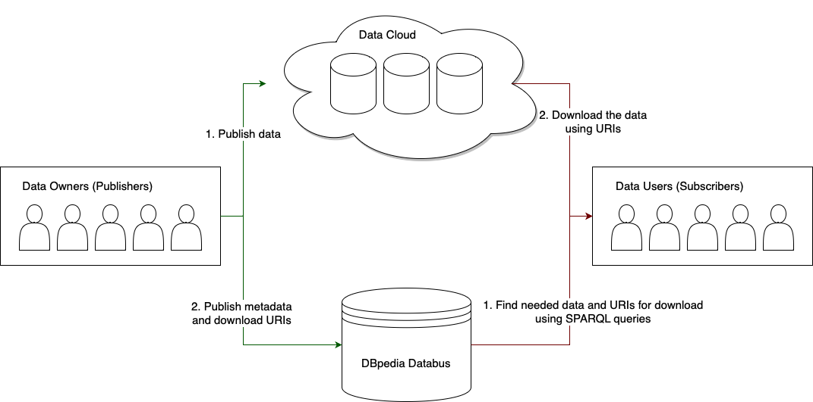

# Databus

DBpedia Databus is an open platform for sharing structured data, 
including RDF (Resource Description Framework) datasets and 
ontologies. It is in essence a repository of metainformation describing your data. 
Databus is built on top of the Linked Data principles and
FAIR (Findable, Accessible, Interoperable, and Reusable).

Databus can be seen as a **data** repository (analogous to [software repositories](https://en.wikipedia.org/wiki/Software_repository), e.g. Maven or Pip). A key difference of Databus from a typical software repository is that it does not store the actual data (i.e. files on disk) but focuses solely on capturing metadata describing your data (i.e. what kind of files and where are they).

The idea is simple. Owners of the data upload the descriptions of their data and where to find it. Users of the data can find and download what they want and check out for updates if new versions of the data were uploaded. **This enables smooth continuous integration processes for your data.**



The key features of DBpedia Databus are:
* Versioning: Databus can be used as a repository, 
like [Maven](https://maven.apache.org) in Java 
or [Pip](https://pypi.org/project/pip/) in Python, for your data artifacts.
* Querying: SPARQL endpoint and Databus Collections provide a rich API 
for querying the metadata you publish.
* Decentralized infrastructure: Databus is built on a decentralized 
infrastructure. This ensures that the data is always available, even if some 
servers go down.
* Provenance tracking: Databus tracks the provenance of data, 
which means that users can see where the data came from and who has 
modified it over time.
* Data quality assessment: Databus provides tools for assessing 
the quality of data, such as validation and testing. This helps to ensure 
that the data is accurate, complete, and consistent.
 different applications and contexts.

The DBpedia Databus is a valuable resource for anyone who 
works with structured data, including researchers, data scientists, 
and developers. It provides a central hub for sharing and discovering 
data, making it easier to leverage the full potential of Linked Data.

## Status 

This repo develops Databus version >= 2.0, which is a major upgrade of version 
1.3-beta (currently running at https://databus.dbpedia.org).

## Important Links

**Documentation:** [https://dbpedia.gitbook.io/databus/overview/readme](https://dbpedia.gitbook.io/databus/overview/readme) 

**API documentation:** [https://github.com/dbpedia/databus/blob/master/API.md](https://github.com/dbpedia/databus/blob/master/API.md)

**Working deployments:** [DBpedia Databus (Reference)](https://dev.databus.dbpedia.org/), [Energy Databus](https://energy.databus.dbpedia.org/)

**Development setup:** [https://github.com/dbpedia/databus/blob/master/devenv/README.md](https://github.com/dbpedia/databus/blob/master/devenv/README.md)

**Our Discord:** [https://discord.gg/fB8byAPP7e](https://discord.gg/fB8byAPP7e)

## Use Cases

More examples of the Databus capabilities are demonstrated in our use cases:
 * [Meta registries](docs/building-meta-registries.md)
 * [Maven for data](docs/maven-for-data-manage-data-dependencies-like-code.md)

## Getting Started

### Preparing Your Data
Databus does not store the data itself but only metainformation, therefore before running the server
we need to publish our data somewhere and make it publicly available. 

**In this step we need to obtain a URI or several URIs pointing to the actual data files for download.** 
As an example here we can publish a single file, e.g. this `README.md`. So our URI is: 
```
https://raw.githubusercontent.com/dbpedia/databus/master/README.md
```
### Running the Server
#### Requirements

In order to run the Databus on-premise you will need `docker` and `docker-compose` 
installed on your machine.&#x20;

* `docker`: 20.10.2 or higher
* `docker-compose`: 1.25.0 or higher

#### Starting the Databus Server

Clone the repository or download the `docker-compose.yml` and `.env` files. 
Both files need to exist in the same directory. Navigate to 
the directory with the files (root of the repo).

&#x20;run:
```
docker-compose up
```
The Databus should be available at `http://localhost:3000`.&#x20;

See [here](docs/running-your-own-databus-server/configuration.md) on detailed configuration of Databus for the use in production.

### Publishing Your First Artifact
To publish an artifact you need to create a Databus account. 
After creating an account, log in and click on your account's 
icon and then `Publish Data`.

Fill in the form for publishing and submit. 
For simplicity, you can enter any name for group, artifact and version.
Use the URI of the file we prepared for publishing (`https://raw.githubusercontent.com/dbpedia/databus/master/README.md`) 
in the `Files` section.  

After publishing the data should be visible on  `account icon -> My Account -> Data tab`.

See more on how to organise your data [here](docs/model.md), there 
you can find detailed explanations and our suggestions on structuring
your datasets.

### Querying Metainformation
After files are published, we can perform queries. Databus offers two 
mechanisms for that: a SPARQL endpoint and Collections. 

Collections allow to flexibly combine files and artifacts together. 
Read more [here](docs/collections.md).

SPARQL endpoint allows to run queries directly. See some examples of the SPARQL queries in [examples](docs/quickstart-examples.md).
### Mods
Databus offers metadata extensions using Mods. 
You can read about them more in detail [here](docs/mods.md).
### API
Instead of using GUI, you can automate your publishing and data retrieving process
 using our http-API. Refer to it [here](docs/api.md).

## Contributing
Please report issues in our [github repository](https://github.com/dbpedia/databus/issues).

If you would like to submit a non-trivial patch or pull request 
we will need you to sign the Contributor License Agreement, we 
will send it to you in that case.
## License

The source code of this repo is published under 
the [Apache License Version 2.0](https://github.com/AKSW/jena-sparql-api/blob/master/LICENSE)

Databus is configured so that the default license of all 
metadata is CC-0, which is relevant for all data of the Model, 
i.e. who published which data, when and under which license.

The individual datasets are referenced via links (dcat:downloadURL) 
and can have any license.

## Acknowledgements

This work was partially supported by grants from 
the German Federal Ministry for Economic Affairs 
and Climate Action (BMWK) to the projects 
LOD-GEOSS (03EI1005E) and  PLASS (01MD19003D)
